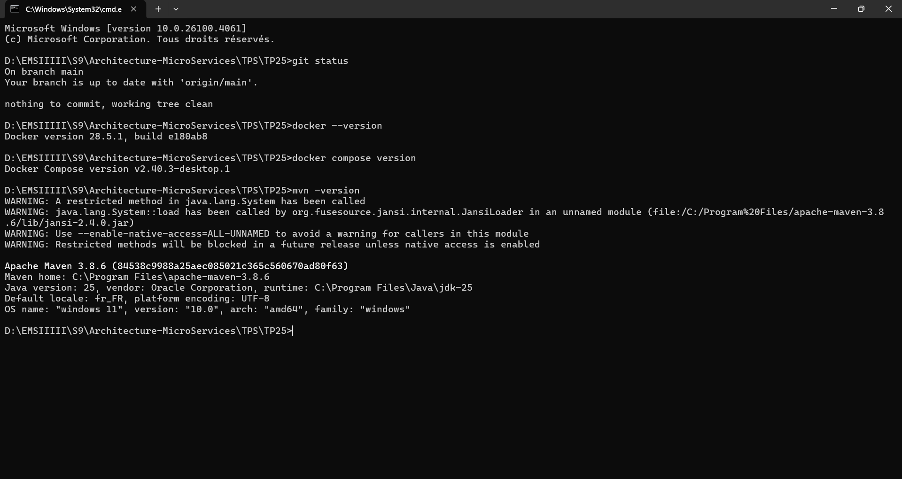
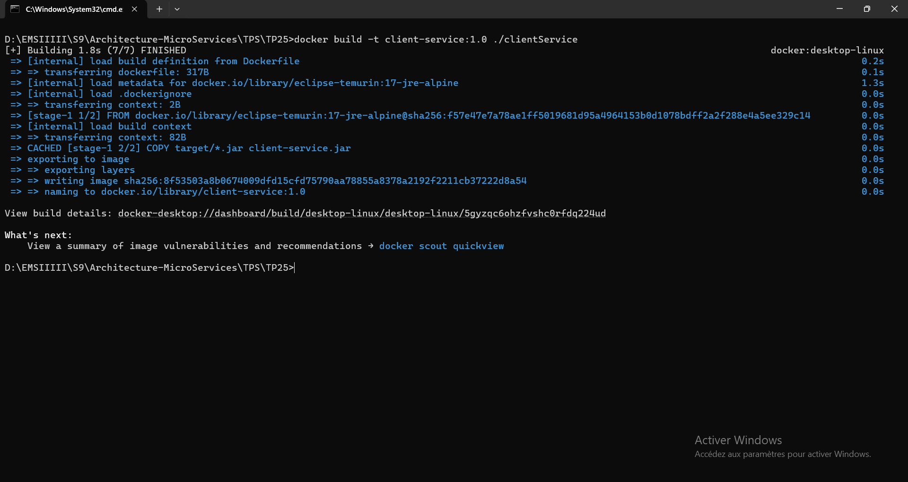
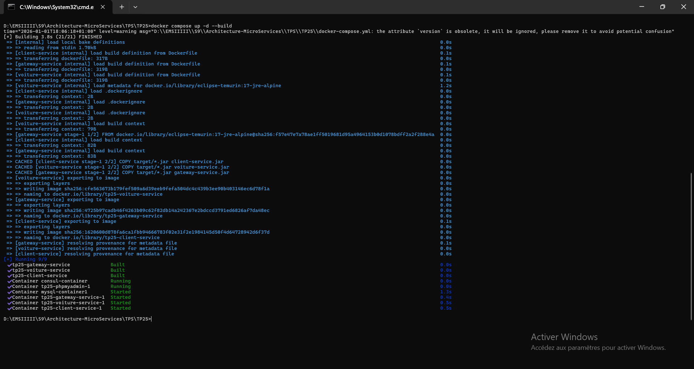
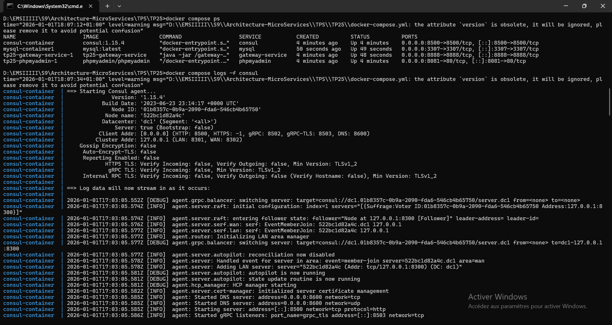
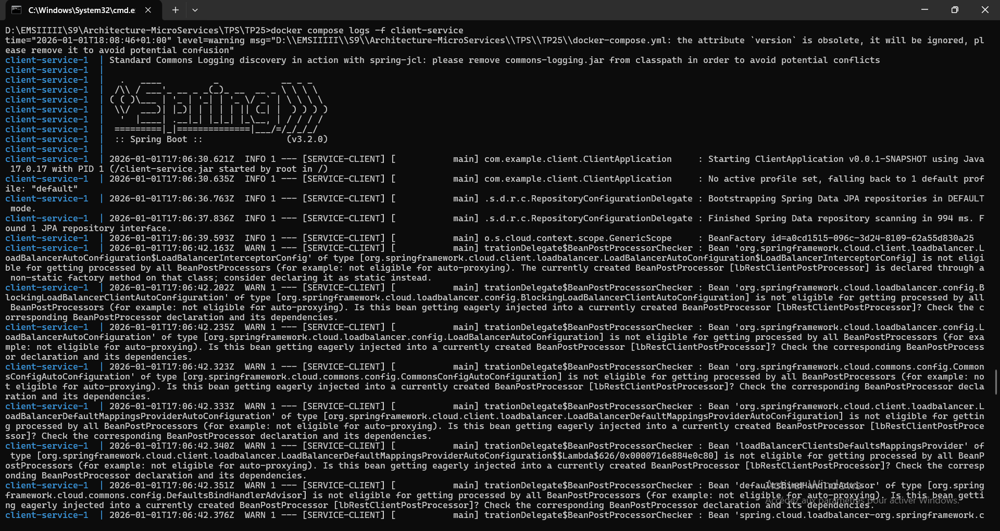
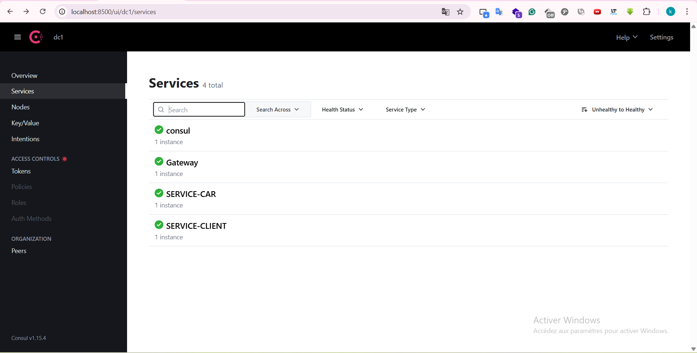
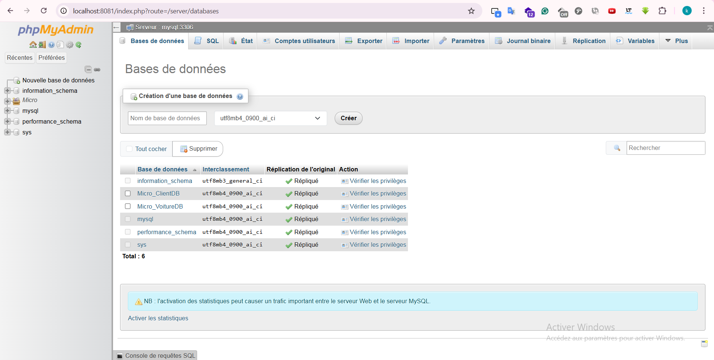
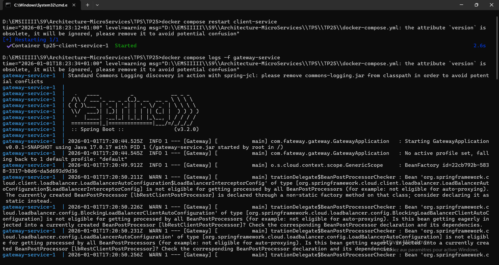

# TP 25 : Conteneurisation des Microservices avec Docker + Découverte de services via Consul

## Objectifs
Orchestration de microservices Spring Boot avec Docker et Consul.

## Architecture
- **Services** : Client, Voiture, Gateway, Consul, MySQL, phpMyAdmin.
- **Réseau** : Bridge unique.

## Déroulement

### 1. Structure et Dockerfiles (17h31)
Création des Dockerfiles multi-stage.

### 2. Configuration (17h56)
Fichier `docker-compose.yml` finalisé.

### 3. Démarrage (18h06)
Build et lancement : `docker compose up -d --build`.

### 4. Logs (18h07)
Vérification du démarrage correct.

### 5. Consul (18h09)
Services enregistrés avec succès.

### 6. Gateway (18h13)
Routage fonctionnel via le port 8888.

### 7. BDD (18h21)
Bases créées visibles sur phpMyAdmin.

### 8. Validation (18h23)
Architecture complète opérationnelle.

